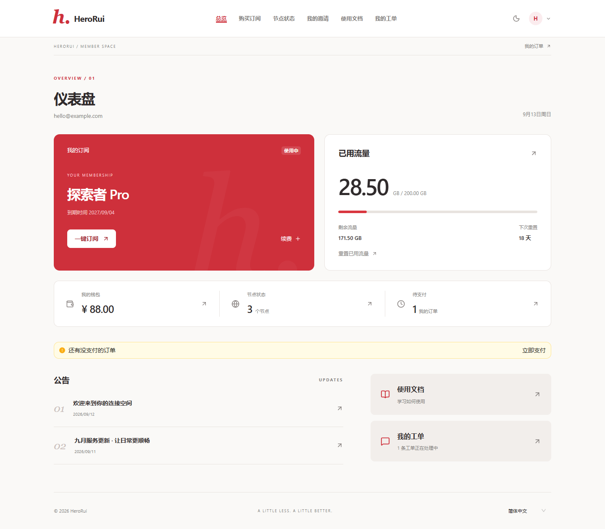
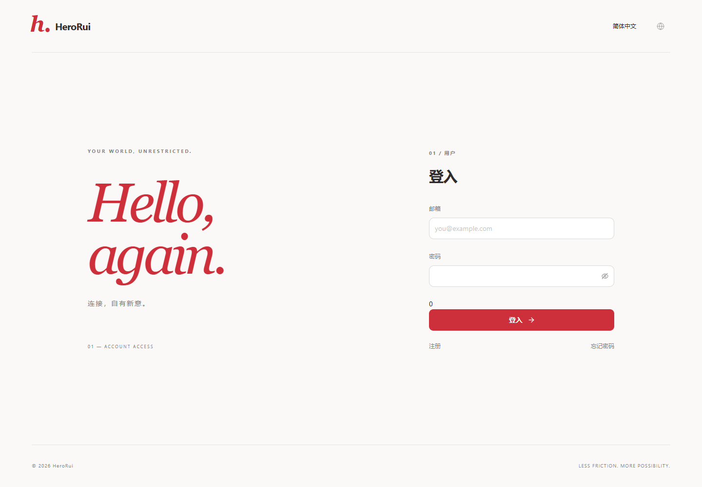
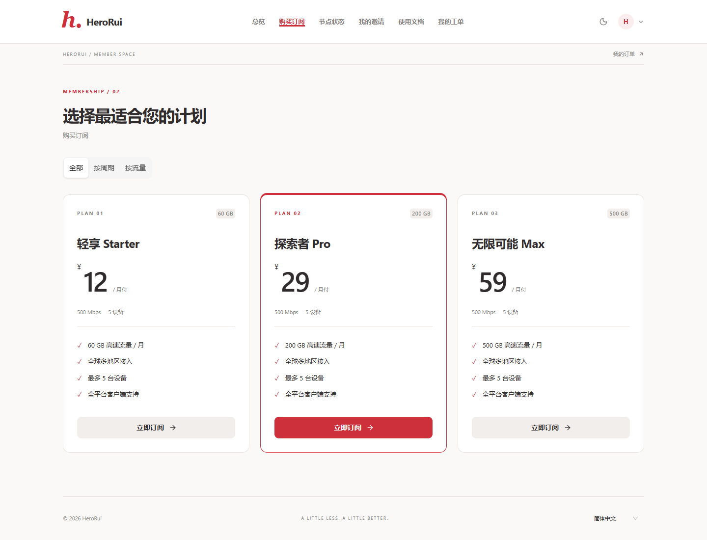
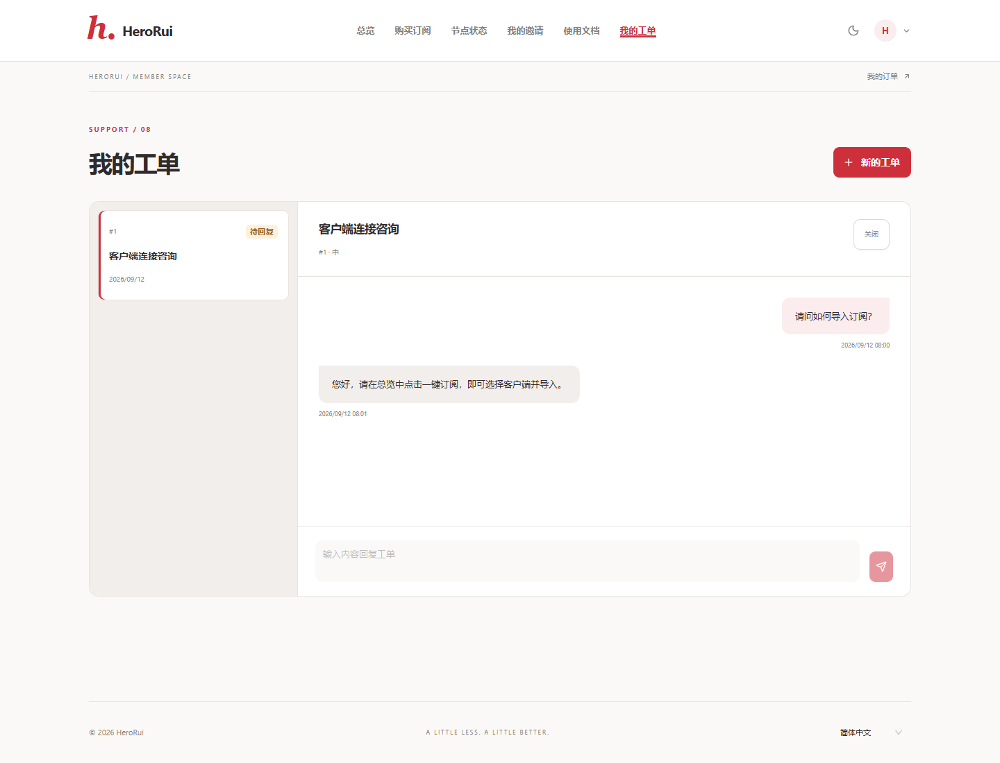
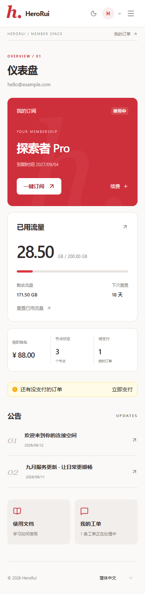

<div align="center">

# HeroRui

**朱红与纸白，让连接回归简单。**

基于 **React + Ant Design + HeroUI** 的独立 Xboard 用户主题。

[下载主题](https://github.com/Grandova/Xboar-HeroRui-Theme/releases/latest/download/HeroRui.zip) · [版本发布](https://github.com/Grandova/Xboar-HeroRui-Theme/releases) · [反馈问题](https://github.com/Grandova/Xboar-HeroRui-Theme/issues)


</div>



## 设计

HeroRui 使用朱红、纸白与暖灰，配合简洁字排、细线分隔与克制的圆角。页面采用全新的顶部导航、订阅概览、独立结算和工单会话布局，适配桌面和移动设备，并支持深浅色切换。

本仓库只包含主题源码、构建脚本、测试和说明。前端独立实现，沿用 Xboard `/api/v1` 接口及主题上传格式，不加载原版 `umi.js`，不修改后端业务逻辑。

## 下载与安装

1. 下载 **[HeroRui.zip](https://github.com/Grandova/Xboar-HeroRui-Theme/releases/latest/download/HeroRui.zip)**。
2. 打开 **Xboard 后台 → 主题管理**，上传 ZIP，无需解压。
3. 选择 **HeroRui** 并保存。如果前台没有变化，请在界面设置的前端主题字段中选择 HeroRui。
4. 刷新前台；如浏览器仍显示旧页面，执行强制刷新。

**请下载 Release 附件 `HeroRui.zip`。GitHub 自动生成的 `Source code (zip)` 是源码压缩包，不能直接作为主题上传。**

站点名称、描述和 Logo 沿用后台设置；主题配置支持自定义 HTML，可用于客服或统计脚本。原版主题可继续保留，必要时在后台切回。

### 更新

下载新版本 Release 的 `HeroRui.zip`，在主题管理中上传更新。Xboard 可能要求新包的 `config.json` 版本号高于已安装版本；自行修改主题后重新发布时，请同步调整 `config.json` 和 `package.json` 的版本。

## 功能

| 模块 | 支持功能 |
| --- | --- |
| 账户认证 | 登录、注册、邀请码、邮箱验证码、密码找回、服务条款、免密链接登录 |
| 验证与第三方登录 | reCAPTCHA v2 / v3、Cloudflare Turnstile、Telegram 登录（依赖后端配置） |
| 订阅管理 | 用量与到期时间、订阅复制、协议选择、二维码、客户端导入、续费、流量重置 |
| 选购与订单 | 套餐分类、付款周期、优惠券、旧订单处理、订单详情、服务端余额抵扣 |
| 支付 | 支付方式选择、手续费展示、二维码支付、收银台跳转、Stripe 卡输入、状态轮询 |
| 网络与内容 | 节点状态和搜索、流量明细、公告、知识库搜索与文章阅读 |
| 推广邀请 | 邀请码与链接、佣金统计、分页记录、余额划转、提现工单 |
| 工单与设置 | 工单创建、会话回复、关闭；修改密码、订阅安全重置、邮件提醒、Telegram 绑定 |
| 界面 | 响应式布局、深浅色切换、多语言、键盘导航 |

可用支付方式、验证码、Telegram、提现等功能由站点后端配置决定。既有主要语言词典已迁移，新增少量提示在缺少译文时回退到中文。

## 页面预览

截图使用模拟数据，仅展示主题界面，不代表实际套餐或服务承诺。

### 登录



### 套餐



### 工单



<details>
<summary>查看手机端截图</summary>



</details>

## 本地开发

建议使用 **Node.js 24 LTS** 和 npm；最低 Node.js 版本为 **22.12**。

```bash
git clone https://github.com/Grandova/Xboar-HeroRui-Theme.git
cd Xboar-HeroRui-Theme
npm ci
npm run dev
```

开发入口默认为 `http://127.0.0.1:4180`。开发页保留演示站点标题，但默认不提供模拟 API；连接实际服务时，需要自行配置开发代理或同源后端。测试脚本中的模拟 API 不会进入生产包。

## 构建主题包

在仓库根目录执行：

```bash
npm ci
npm run build
```

产物如下：

```text
dist/
├── HeroRui.zip             # 上传到 Xboard 后台的主题包
├── HeroRui.sha256          # ZIP 的 SHA-256 校验值
└── HeroRui.manifest.json   # 包内文件清单及校验值

theme/HeroRui/             # 主题展开文件
├── config.json
├── dashboard.blade.php
├── assets/
├── README.md
└── LICENSE
```

构建过程自动注入 Xboard 的站点设置与 `/theme/<主题名>/assets/` 资源地址。ZIP 根目录直接包含 `config.json` 和 `dashboard.blade.php`，可直接上传。

## 测试

```bash
npm ci
npx playwright install chromium
npm test
```

测试会构建生产版本，启动临时预览服务器，使用模拟 API 执行 **32 项主流程检查**和 **6 项第三方集成契约检查**。首次发布已全部通过。结果位于 `dist/HeroRui-preview/`。

如需重新生成演示截图：

```bash
npm run build
npm run preview
```

`npm run preview` 会自动使用模拟数据生成截图，随后关闭浏览器和服务器；它不是持续运行的在线演示站。

如希望使用已安装的 Google Chrome，可设置环境变量 `PLAYWRIGHT_CHANNEL=chrome` 后运行测试。

## 兼容性与验证范围

主题依据开发时提供的 Xboard 源码接口和主题加载规则实现。目前没有覆盖所有 Xboard 分支或历史版本；接口存在自定义修改的站点需要单独联调。

本地已验证浏览器交互、请求参数、金额及流量换算、移动布局、错误重试、生产构建和 ZIP 完整性。第三方验证码、Telegram 和 Stripe 使用模拟 SDK 测试，支付使用模拟响应。**尚未在真实站点验证后台安装、邮件送达、验证码挑战、客户端唤起及支付到账。** 建议先在测试站完成这些链路验证。

详细记录见 [VALIDATION.md](VALIDATION.md)。

## 目录

```text
src/                 React 页面、组件、样式与语言词典
scripts/package.mjs  Xboard Blade 生成、主题打包与校验清单
tests/               模拟 API、浏览器回归和截图脚本
docs/images/         README 页面预览
config.json          Xboard 主题标识及可配置字段
vite.config.js       前端构建配置
```

## 致谢与许可

界面使用 [Ant Design](https://ant.design/) 与 [HeroUI](https://www.heroui.com/)，图标使用 [Lucide](https://lucide.dev/)。保留了所提供 Xboard 项目的 MIT 许可证及版权声明，原版静态语言词典用于既有文案兼容；各依赖遵循其自身许可证。

详见 [LICENSE](LICENSE)。
